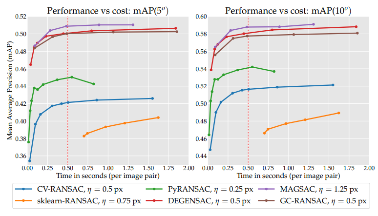
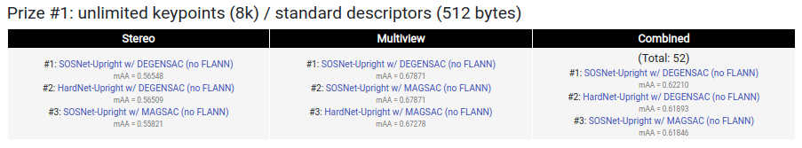
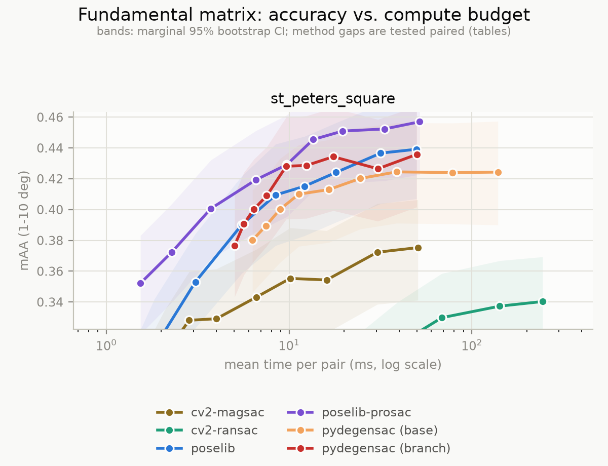
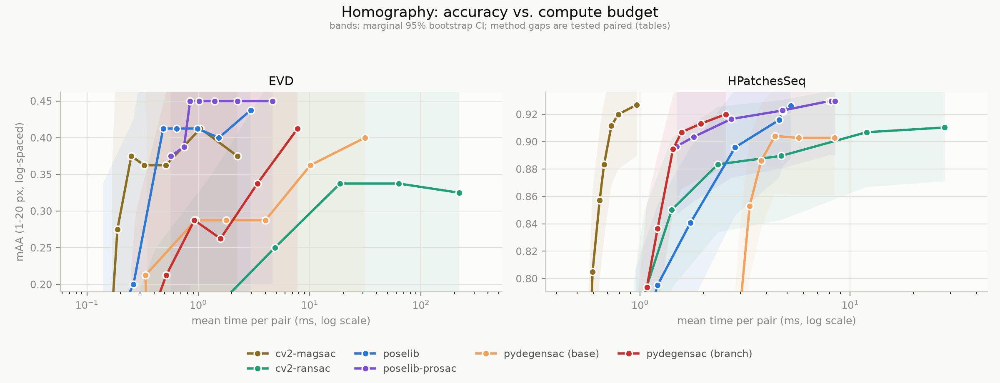

# pydegensac

This repository contains an Python wrapper of RANSAC for homography and fundamental matrix estimation
from sparse correspondences. It implements [LO-RANSAC](https://link.springer.com/chapter/10.1007/978-3-540-45243-0_31) and [DEGENSAC](http://citeseerx.ist.psu.edu/viewdoc/download?doi=10.1.1.466.2719&rep=rep1&type=pdf).

It was originally located in [https://github.com/ducha-aiki/pyransac](https://github.com/ducha-aiki/pyransac), but was renamed to avoid conflict with already existing [pyransac](https://pypi.org/project/pyransac/) in pypi from other author.

> ### macOS users: upgrade
>
> Every macOS build published before **0.3.0** silently skipped all of its
> LAPACK calls. The C sources guarded them behind `#ifdef _WIN32` / `#ifdef
> __linux__`, and macOS defines neither, so the preprocessor removed them: the
> least-squares refits that local optimisation depends on returned an identity
> matrix (F) or an untouched covariance matrix (H). LO-RANSAC's local
> optimisation — the thing that makes this estimator worth using — never ran.
>
> Results were degraded, not broken, so nothing failed loudly: measured on
> public data it cost **0.11 mAA on fundamental and 0.21 on homography**.
> Anything you benchmarked on macOS against other estimators was measuring a
> crippled build. Linux and Windows were unaffected.
>
> To check an existing install:
>
> ```bash
> nm -u $(python -c "import pydegensac,glob,os;print(glob.glob(os.path.dirname(pydegensac.__file__)+'/*.so')[0])") | grep -E 'dgesvd|dsyev'
> ```
>
> Empty output means you have an affected build.

# Performance

Vanilla pydegensac implementation is marginally better than OpenCV one and with degeneracy-check enabled (DEGENSAC) it is the state of the art,
according to the recent study Yin et.al."[Image Matching across Wide Baselines: From Paper to Practice](https://arxiv.org/abs/2003.01587.pdf)", 2020.







For homography, pydegensac is worse than newest OpenCV MAGSAC++ (`cv2.USAC_MAGSAC`), but better than OpenCV vanilla RANSAC, according to recent Barath et al. [A Large Scale Homography Benchmark](https://arxiv.org/abs/2302.09997), CVPR2023


## Speed/accuracy against the current field (2026)

`benchmarks/` is a self-contained accuracy-vs-compute benchmark on public data:
fundamental matrix on IMC-2020 PhotoTourism val (600 pairs of
`st_peters_square`, pose mAA 1-10°), homography on EVD + HPatchesSeq (the
CVPR-2020 RANSAC tutorial data, reprojection mAA 1-20 px). Every method runs at
its own tuned thresholds; each point on a curve is one iteration budget.

<table>
<tr><th width="50%">Linux x86-64</th><th width="50%">Apple M1</th></tr>
<tr>
<td></td>
<td></td>
</tr>
<tr>
<td></td>
<td></td>
</tr>
</table>

**Fundamental matrix.** poselib with PROSAC leads, but pydegensac is no longer
separable from it — -0.017 mAA on Linux, -0.021 on M1, both with confidence
intervals containing zero — and it beats both OpenCV estimators by a wide
margin. It costs about 1.3x the leader on Linux (52 vs 41 ms/pair) and is level
with it on M1 (50 vs 52).

**Homography.** pydegensac is the second-cheapest estimator in the roster
(2.3 ms/pair on Linux, 2.6 on M1), undercutting both poselib variants, but it
remains measurably behind the top three on accuracy: -0.021 mAA on Linux,
-0.010 on M1, both intervals excluding zero. `cv2.USAC_MAGSAC` wins homography
outright, matching the leader's accuracy at 0.9 ms. That is consistent with the
2023 homography benchmark above.

So the two problems now have different answers: on F pydegensac is competitive
with the best available, on H it is a cost/accuracy trade rather than a
straight win. (EVD's 8 test pairs cannot separate anything, hence the
confidence bands swamping that panel.)

Both platforms show the same picture, but the version-to-version speed-up
differs: the 0.3.0 optimisation work is worth **2.2x (F) / 1.7x (H) on Linux**
and **2.3x / 2.9x on M1**. The gap is mostly the denominator — macOS had more
to gain because a lock in its `srandom()` left the old build further behind.

Full results, protocol, and the caveats that matter (run-to-run scatter,
threshold-transfer failure between scenes):
[`docs/reports/2026-08-11-ransac-benchmark.md`](docs/reports/2026-08-11-ransac-benchmark.md).
Reproduce with `cd benchmarks && python setup_data.py && ./run_ab.sh`.

# Installation

To build and install `pydegensac`, you can use pip from Windows, macOS and Linux:

```bash
pip install pydegensac
```

> **Do not pin `pydegensac==0.1.2` if you are on numpy 2.x.** That combination
> returns **every correspondence as an inlier**, silently — on a synthetic set
> with 150 planted outliers among 300 matches it reports 300 inliers, where the
> same wheel under numpy 1.26 correctly reports 150. It is the old pybind11
> incompatibility that `0.2` was yanked for, but `0.1.2` was never yanked, so
> it is what an old pin or an unconstrained resolve on a fresh numpy can still
> land on. Use the latest release, or hold numpy below 2.0.

Or clone or download this repository and then, from within the repository, run:

```bash
python3 ./setup.py install
```

or

```bash
pip3 install .
```

To check if everything works, run the following:

```bash
cd examples
python -utt simple-example.py
```

You should see the following output:

```
Running homography estimation
cv2 found 40 inliers
OpenCV runtime 0.02355  sec
pydegensac found 78 inliers
pydegensac runtime 0.00320  sec
H =  [[ 5.59934334e-03 -2.36037104e-03 -2.78369679e+01]
 [ 4.86321171e-02 -1.24542142e-01 -1.00600649e+01]
 [ 1.95536148e-04  9.43300063e-06 -1.76685691e-01]]
Running fundamental matrix estimation
cv2 found 32 inliers
OpenCV runtime 0.67554  sec
pydegensac found 44 inliers
pydegensac 0.04702  sec
F =  [[-7.35044984e-04 -2.72572333e-03  1.38155992e+00]
 [ 1.43946998e-03  2.33120834e-05 -7.88961637e-01]
 [-3.35556093e-01  1.00000000e+00 -1.78675406e+02]]
```

# Building hints from Tomasz Malisiewicz

1. Compiling pydegensac without a system-wide install.

```bash
python3 ./setup.py build
```

2. Compiling on Mac OS X computer
Use GCC instead of Clang. The most recent version on my machine (installed via brew) is gcc-8. Try this:

```bash
CC=gcc-8 python3 ./setup.py build
```

*(Note, 2026: this hint dates from 2020. Current Clang builds pydegensac fine and is the recommended compiler on macOS — prefer the platform default unless you hit an actual failure.)*

3. Compiling on Ubuntu 18.04
You need LAPACK and a few other libraries and I always forget those specific package names. Take a look at my pydegensac Dockerfile to see the exact packages you need to apt install on an Ubuntu 18.04 system (https://github.com/quantombone/pydegensac-dockerfile/blob/master/Dockerfile)

```bash
FROM ubuntu:18.04
```

## update system
```bash
RUN apt-get clean
RUN apt-get update
RUN apt-get install -qy \
    git python3 python3-setuptools python3-dev
RUN apt-get install -y cmake libblas-dev liblapack-dev gfortran
RUN apt-get install -y g++ gcc
```

## download and build pydegensac
```
RUN git clone https://github.com/ducha-aiki/pydegensac.git
WORKDIR pydegensac
RUN python3 ./setup.py build
```

## copy built assets into target directory (which will be a -v volume)
```docker
CMD cp -R /pydegensac/build/lib.linux-x86_64-3.6/pydegensac /target_directory
```

# dockerfile

https://github.com/quantombone/pydegensac-dockerfile


# Example of usage

```python
import pydegensac
H, mask = pydegensac.findHomography(src_pts, dst_pts, 3.0)
F, mask = pydegensac.findFundamentalMatrix(src_pts, dst_pts, 3.0)

```

See also this [notebook](examples/simple-example.ipynb) with simple example

And this [notebook](examples/how-to-use-detailed.ipynb) with detailed explanation of possible options


# Requirements

- Python 3
- CMake 2.8.12 or higher
- LAPACK, 
- BLAS (OpenBLAS, MKL, Atlas, ...)
- A modern compiler with C++11 support


## Citation

Please cite us if you use this code:

    @InProceedings{Chum2003,
    author="Chum, Ond{\v{r}}ej and Matas, Ji{\v{r}}{\'i} and Kittler, Josef",
    title="Locally Optimized RANSAC",
    booktitle="Pattern Recognition",
    year="2003",
    }
    
    @inproceedings{Chum2005,
    author = {Chum, Ondrej and Werner, Tomas and Matas, Jiri},
    title = {Two-View Geometry Estimation Unaffected by a Dominant Plane},
    booktitle = {CVPR},
    year = {2005},
    }
    
    @article{Mishkin2015MODS,
          title = "MODS: Fast and robust method for two-view matching ",
          journal = "Computer Vision and Image Understanding ",
          year = "2015",
          issn = "1077-3142",
          doi = "http://dx.doi.org/10.1016/j.cviu.2015.08.005",
          url = "http://www.sciencedirect.com/science/article/pii/S1077314215001800",
          author = "Dmytro Mishkin and Jiri Matas and Michal Perdoch"
    }
    


    
# Acknowledgements

This wrapper part is based on great [Benjamin Jack `python_cpp_example`](https://github.com/benjaminjack/python_cpp_example).
