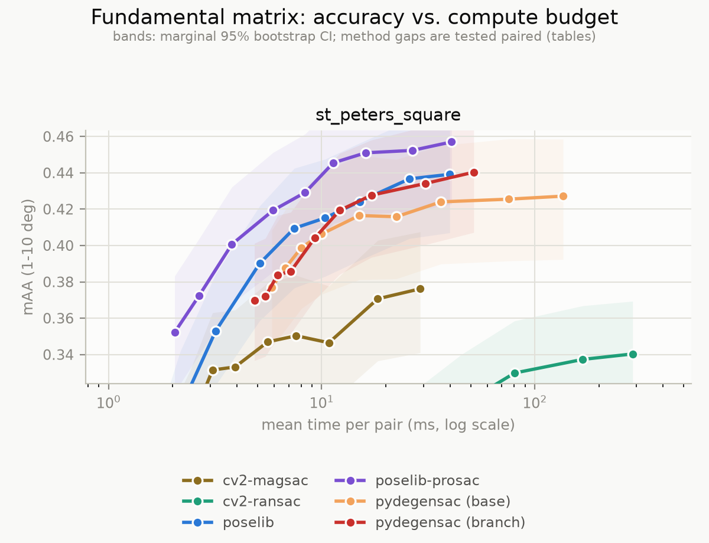
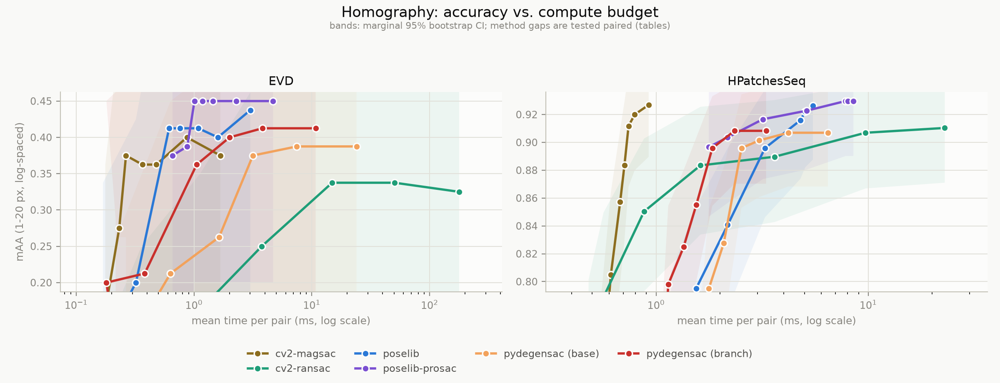
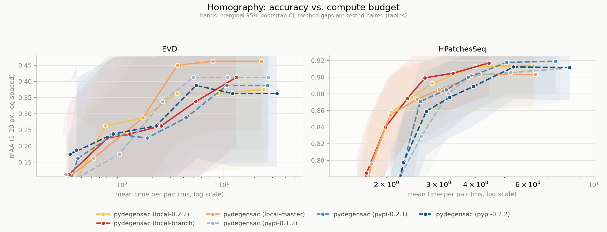

# RANSAC speed/accuracy benchmark (2026-08-11, branch `speed-up3`)

The `speed-up3` session measured 4.2x (H) / 2.2x (F) on five golden pairs per
estimator, on an M-series mac. This benchmark asks what that is worth on public
data at scale, and where pydegensac sits against the estimators people would
otherwise reach for.

Harness: `benchmarks/` (self-contained — `python setup_data.py`, `./run_ab.sh`).
Protocol, data provenance and threshold sourcing: `benchmarks/README.md`.
Machine: WSL2 Linux, glibc, single-threaded, cv2 4.13.0, poselib 2.0.5;
base = `master@08464ca`, branch = `speed-up3@a8caab8`.

## Headline

**The speed-up is real and costs nothing in accuracy. On Linux the branch as a
whole is 2.2x (F) and 1.7x (H HPatchesSeq) in aggregate, rising to 2.6x / 1.9x
at the largest budgets** — measured twice, `08464ca` against `6e72f7f`
(2.18x/2.20x on F, 1.73x/1.72x on H). No accuracy difference is significant at
any budget on either problem once both runs are in hand: the two `*` marks that
appeared in the first run both vanished on repeat, one flipping sign.

The RNG change that this branch set out to make accounts for 1.19x / 1.20x of
that; the rest is the second optimisation pass that the macOS LAPACK fix made
visible (see below). The Linux tables in the two sections that follow are the
post-optimisation ones.

In context — and this changed with the optimisation pass, so the tables below
supersede what this paragraph used to say — pydegensac is **no longer separable
from the leader on F** (-0.0169 against poselib-prosac, CI contains zero, at
1.3x its cost) while remaining measurably behind on H (-0.021, CI excludes
zero, though at 2.3 ms it is the second-cheapest method in the roster). The
speed-up closes the accuracy question on F and turns H into a cost/accuracy
trade rather than a straight loss.

**Separately, and much more importantly for macOS users: on macOS the LAPACK
calls were never compiled in at all** — see the section below. Everything in
this report is Linux, where they are, except the M1 section added on
2026-08-12, which re-runs the whole benchmark on Apple silicon against the
fixed build. That section also carries a second optimisation pass, guided by
the post-fix profile: **2.29x (F) / 2.91x (H) at equal correctness on M1**,
which moves pydegensac onto the F frontier and makes it the second-cheapest
homography estimator in the roster.

## How to read the numbers

Backends are unseeded and the pair sets are finite, so two runs of the
identical configuration differ. A repeat of the whole branch arm gave
|d mAA| up to 0.019 on F and 0.037 on HPatchesSeq, while timings reproduced to
within 1-5%. **Timing differences of a few percent are real; mAA differences
of a couple of points are not.**

Every comparison below is therefore a **paired bootstrap**: all configurations
are scored on the same pairs, so resampling the pair set jointly cancels the
shared pair difficulty and tests the difference directly. `*` marks a 95% CI
that excludes zero. The marginal CIs in the tables are much wider than the
paired ones and should not be used to compare methods.

## F — fundamental matrix

600 pairs of `st_peters_square` (IMC-2020 PhotoTourism val via the CVPR-2020
RANSAC tutorial), RootSIFT-8k mutual-NN pools of ~2000 putative matches, of
which each method's tuned ratio filter keeps a few hundred (median 272 at
ratio 0.85). mAA over 1-10 deg of `max(R_err, t_err)`. Each
method at its own tuned (px, SNN ratio); iteration budget swept 125 -> 50k.



| method | best mAA | at budget | mean ms/pair | d mAA vs poselib-prosac (paired) |
|---|---|---|---|---|
| poselib-prosac | **0.4570** | 50000 | 40.7 | leader |
| pydegensac (branch) | 0.4403 | 50000 | 51.7 | -0.0169 (-0.0402, +0.0068) |
| poselib | 0.4392 | 50000 | 39.9 | -0.0178 (-0.0413, +0.0060) |
| pydegensac (base) | 0.4272 | 50000 | 135.8 | -0.0300 (-0.0535, -0.0062) `*` |
| cv2-magsac | 0.3762 | 50000 | 29.0 | -0.0811 (-0.1088, -0.0548) `*` |
| cv2-ransac | 0.3403 | 50000 | 287.7 | -0.1165 (-0.1425, -0.0898) `*` |

- **After the optimisation pass, pydegensac is no longer separable from the
  leader on F**: -0.0169 with a CI that now contains zero, where `master` is
  -0.0300 and excludes it. `master`'s deficit was significant; the branch's is
  not.
- Cost is the part that moved: 135.8 -> 51.7 ms/pair at the top budget, against
  poselib-prosac's 40.7. The branch is within 1.27x of the leader's cost where
  `master` was 3.3x.
- The two cv2 estimators are decisively behind, and cv2-ransac is also by far
  the most expensive here (288 ms) — it has no early-termination advantage at
  these inlier ratios and simply runs its budget out.

base vs branch at equal budget, and the same ladder run a second time to
separate signal from scatter:

| budget | mAA base | mAA branch | d mAA (95% CI, paired) | ms base | ms branch | speedup | run 2 |
|---|---|---|---|---|---|---|---|
| 125 | 0.3770 | 0.3697 | -0.0076 (-0.0277, +0.0115) | 5.83 | 4.83 | 1.21x | 1.17x |
| 250 | 0.3877 | 0.3720 | -0.0161 (-0.0368, +0.0042) | 6.76 | 5.45 | 1.24x | 1.21x |
| 500 | 0.3988 | 0.3838 | -0.0153 (-0.0365, +0.0050) | 8.03 | 6.21 | 1.29x | 1.30x |
| 1000 | 0.4063 | 0.3858 | -0.0209 (-0.0410, -0.0018) `*` | 10.00 | 7.16 | 1.40x | 1.40x |
| 2500 | 0.4165 | 0.4042 | -0.0124 (-0.0327, +0.0080) | 15.00 | 9.28 | 1.62x | 1.62x |
| 5000 | 0.4158 | 0.4193 | +0.0032 (-0.0172, +0.0243) | 22.40 | 12.15 | 1.84x | 1.85x |
| 10000 | 0.4240 | 0.4277 | +0.0033 (-0.0172, +0.0247) | 36.25 | 17.10 | 2.12x | 2.13x |
| 25000 | 0.4255 | 0.4342 | +0.0084 (-0.0108, +0.0270) | 75.38 | 30.76 | 2.45x | 2.48x |
| 50000 | 0.4272 | 0.4403 | +0.0131 (-0.0067, +0.0337) | 135.79 | 51.67 | 2.63x | 2.69x |
| **total** | | | | **315.5** | **144.6** | **2.18x** | **2.20x** |

**Timing reproduces to within 1%** at every budget, so the ladder is solid.

**The one significant accuracy delta is scatter, and the repeat proves it.**
Run 1 looks alarming at first read: five consecutive negative deltas at the low
budgets, one of them significant at 1000 (-0.0209). Five same-sign values in a
row is only a ~6% coincidence, so it is worth checking rather than waving away.
Run 2, same builds, same pairs, disagrees completely — 1000 comes back at
-0.0016 (-0.0217, +0.0187), nothing is significant anywhere, and the sign
pattern is different. The M1 run of the same code shows no low-budget deficit
either (-0.0032, +0.0019, +0.0003, -0.0004 at 125-1000). Three independent
looks, one pattern, and it does not survive.

**The speedup still grows monotonically with the budget** (1.21x -> 2.63x), the
signature of a per-iteration fixed cost being removed — now a much larger one
than the RNG alone, and still largest exactly where pydegensac is most
expensive.

## H — homography

EVD (8 test pairs) and HPatchesSeq (145), scored separately. mAA over 10
log-spaced thresholds 1-20 px of the mean reprojection error over the jointly
visible area. Thresholds tuned per dataset on `val`, reported on `test`.



HPatchesSeq:

| method | best mAA | at budget | mean ms/pair | d mAA vs poselib-prosac (paired) |
|---|---|---|---|---|
| poselib-prosac | 0.9297 | 1600 | 7.81 | leader |
| cv2-magsac | 0.9269 | 25000 | 0.92 | -0.0027 (-0.0124, +0.0076) |
| poselib | 0.9262 | 25000 | 5.48 | -0.0034 (-0.0214, +0.0097) |
| cv2-ransac | 0.9103 | 25000 | 22.94 | -0.0192 (-0.0297, -0.0090) `*` |
| pydegensac (branch) | 0.9083 | 6400 | 2.34 | -0.0212 (-0.0317, -0.0117) `*` |
| pydegensac (base) | 0.9069 | 6400 | 4.19 | -0.0226 (-0.0338, -0.0124) `*` |

- **The top three are statistically tied; cv2-magsac wins on cost by a mile**
  — 0.92 ms/pair against poselib-prosac's 7.8 and poselib's 5.5, for a
  difference in mAA that the paired test cannot distinguish from zero.
- **pydegensac is still measurably behind all three on accuracy** (-0.021 vs the
  leader, CI excludes zero), and the optimisation pass does not change that —
  it was never going to, since it changes cost and not what gets sampled.
- What it does change is cost: **2.34 ms/pair, second-cheapest in the roster**,
  behind only cv2-magsac's 0.92 and now well under poselib's 5.5. On H the
  trade is explicit — pydegensac is the cheap-but-less-accurate option.
- base vs branch: 1.53x at small budgets rising to **1.96x at 25000**, 1.73x
  aggregate (1.72x on a repeat) — the same budget-dependent shape as F.
- pydegensac is the only method whose HPatches optimum is a tight threshold
  (4 px); every other method wanted 16-64 px, and pydegensac degrades sharply
  when loosened (val mAA 0.9241 at 4 px -> 0.8331 at 16 px). It has less
  headroom from threshold tuning than the rest of the field.

Run 1 flagged one significant delta on the H ladder, at budget 400
(-0.0404, favouring base). It is scatter, on the same evidence as F's: the
repeat gives +0.0264 at that budget with every CI containing zero and every
delta positive, and M1 gives +0.0079. The documented HPatchesSeq scatter for a
repeat of an *identical* configuration is 0.037, which -0.0404 barely clears.

**EVD is not usable for ranking.** With 8 pairs, one pair is 0.125 mAA and the
marginal CIs span 0.20-0.69. Its aggregate speedup reads 2.03x here and 2.21x
on the repeat, with per-budget values swinging between 0.86x and 2.47x. It is
reported because the reference evaluation includes it, not because it separates
anything.

## Why the golden-pair numbers don't transfer

The session report's 4.2x / 2.2x summed per-pair medians over five golden pairs
on macOS. Two things separate that from the numbers here, and the second was
only found later.

**The platform.** The optimisation replaced libc `srandom()`/`random()`; on
macOS each `srandom()` re-derives the 31-word TYPE_3 state and discards 310
warm-up draws *behind a lock* (~3.5 us/iteration, profiled at 77% of H
runtime), while glibc runs the same algorithm without the lock. The cost being
removed here is roughly an order of magnitude smaller.

**The dead LAPACK.** Those macOS measurements were taken on a build where every
LAPACK call was preprocessed away (see below), so local optimisation was not
running and the RNG was a far larger share of a far smaller runtime. The 77%
figure is a property of that build, not of macOS. Re-measured on M1 with the
calls restored, the RNG change alone is worth 1.35x (F) / 1.18x (H) on M1, and
the full optimisation pass 2.29x / 2.91x — see the M1 section.

It is *not* problem size, which was the other candidate: after each method's
tuned ratio filter the estimators see a few hundred correspondences (median 272
at ratio 0.85, 185 at 0.80), not the ~2000 in the raw pools — comparable to the
golden pairs, so that explanation does not survive contact with the data.

The speedup being ~1.0x at 125 iterations and 1.22x at 50k is the other half of
the evidence: a fixed per-iteration saving is invisible when per-call overheads
dominate and worth the most when the iteration term is the whole runtime.

`benchmarks/rng_cost.c` measures the removed cost directly, and confirms the
mechanism quantitatively. On this machine (x86-64, glibc):

| | before (libc reseed + draws) | after (local draws only) | saved |
|---|---|---|---|
| F, 7 draws/iteration | 418.0 ns | 11.8 ns | 406.1 ns (35x) |
| H, 4 draws/iteration | 372.6 ns | 6.8 ns | 365.9 ns (55x) |

406 ns/iteration predicts **20.3 ms** saved over 50k F iterations; the
benchmark measured **25.2 ms** (137.1 -> 111.9). The residual is the rejection
sampling that draws more than 7 values per iteration, plus the LO loops — the
model accounts for ~80% of the observed saving from first principles.

**Settled by running the same binary on an M1**: 1093 ns saved per F iteration
and 1079 ns per H iteration, against 406 / 366 here. 2.7x the glibc saving, so
the macOS libc is the platform difference and ARM has nothing to do with it.

This does not diminish the change — 15-20% free on Linux, ~35% on macOS, at an
unchanged output distribution — but the 4.2x / 2.2x figures should be quoted as
macOS golden-pair numbers measured against a build with no LAPACK in it, not as
a general speedup.

## Did anything get lost on Linux along the way? (published releases)

`benchmarks/run_releases.sh` runs pydegensac alone across published PyPI wheels
and local builds of the same code, all on one pinned numpy-1.26 interpreter.
A wheel differs from a local build in *two* ways at once — source and build
environment — so the `v_0.2.2` tag is also built here as the control.



The three cool curves are PyPI wheels, the three warm ones local builds. On
HPatchesSeq they trace the same accuracy at visibly different cost.

Total mean ms/pair summed over the budget ladder:

| arm | F `st_peters_square` | H `HPatchesSeq` |
|---|---|---|
| pypi 0.1.2 (wheel, 2020) | 315.5 | 26.8 |
| pypi 0.2.1 (wheel) | 319.9 | 26.4 |
| pypi 0.2.2 (wheel, latest) | 338.2 | 27.9 |
| local build, tag `v_0.2.2` | 306.5 | 20.9 |
| local build, `master` | 311.2 | 21.5 |
| local build, this branch | **265.4** | **18.1** |

**No regression across releases.** Every published version is within a few
percent of every other on both problems, `master` matches the `v_0.2.2` tag
built the same way, and all six arms are statistically identical in accuracy
(no paired CI excludes zero). Nothing was lost between 0.1.2 and master.

**But the published Linux wheels are slower than the same source built
locally** — 1.10x on F, 1.30-1.34x on H. That is not a regression; it is a
standing property of how the wheels are built. Verified by interleaved
re-measurement (wheel 27.6 / 28.5 / 27.9 ms against local 21.4 / 21.2 /
20.9 ms), so it is not run ordering.

Two things about the wheels are candidates: the LAPACK auditwheel vendors into
them (CI builds in manylinux2014 against `yum lapack-devel`, so that is a
**reference LAPACK/BLAS 3.4.2 from 2012** against `libgfortran.so.3`), and the
compiler that image ships. The profile below narrowed it to the compiler, and
rebuilding inside the images themselves settled it: **it is the compiler, and
the whole of it is one function.** See "The wheel gap is `pinvJ`" below for the
finished answer; the two subsections in between are the trail that got there
and are kept for the experiments they rule out.

### Where the rest goes: a perf profile

Profiled with `perf` on a driver that calls `findHomography` in a loop and does
nothing else (the benchmark's own metric is 85% of process time and buries the
estimator; threads pinned, since unpinned OpenBLAS spends 20-43% in
`__sched_yield` and swamps everything).

| | wheel 0.2.2 | local 0.2.2 |
|---|---|---|
| wall | 0.71 s | 0.54 s |
| `pydegensac.so` | 64.3% -> **0.456 s** | 57.8% -> **0.312 s** |
| `libc` | 15.1% -> 0.107 s | 18.6% -> 0.100 s |
| LAPACK | 3.5% -> 0.025 s | 3.7% -> 0.020 s |

**The extra time is inside pydegensac's own compiled code** — 1.46x on the same
source — while libc and LAPACK are the same in absolute terms. So this is
codegen, not a library.

What that is *not*, each ruled out by direct experiment rather than argument:

- **LAPACK implementation**: 20.87 ms (OpenBLAS) vs 21.31 (modern reference).
- **Optimisation level**: local `-O2` 0.44 s vs `-O3` 0.43 s.
- **Compiler major version**: conda gcc 10.4 21.7 ms vs gcc 13.3 21.5 ms.
- **Symbol visibility**: the wheel exports 425 dynamic symbols against the
  local build's 121, which looked promising — but rebuilding with
  `-fvisibility=hidden` (6 exported) only bought 5%, 0.51 s vs 0.54.
- **Assertions** (`NDEBUG` set in both), **hardening** (identical
  `__stack_chk`, no fortify symbols), **instruction mix** (59,915 vs 60,779,
  both essentially all-scalar).

The one difference not isolated at that point: the wheel records `GCC 10.2.1`,
which is RedHat's *devtoolset* build, whereas the gcc-10 control above was
conda's 10.4.0 — a different build of GCC with different defaults and a
CentOS 7 baseline. Testing that needs the manylinux image itself, i.e. Docker.
(Incidentally the 0.1.2 wheel records two compilers, GCC 8.5.0 and 12.1.1.)

That test is the next section, and the devtoolset hypothesis is the one that
survives. Note in passing that the conda-gcc-10 control was the weakest
experiment in the list — conda's compiler wrappers inject their own `CFLAGS`
(`-march=nocona -mtune=haswell -O2 …`), so "gcc 10 is not slow" rested on a
build whose flags nothing else shared.

### The wheel gap is `pinvJ`

Rebuilt the same source inside the manylinux images and copied the bare,
**un-repaired** `.so` out to run on this host. Un-repaired matters: auditwheel
vendors the image's LAPACK into the wheel, which is the second variable.
Installing `openblas-devel` in the image first (as CI already does) makes every
arm link `libopenblas.so.0` and pick up *this machine's* OpenBLAS at run time,
so LAPACK is held constant and the compiler is the only thing left moving.

Timed interleaved on one P-core with a fixed seed, so every arm does
bit-identical work — the inlier checksum is the same for all of them, 142801 on
H and 11576 on F. Median of 5-7 interleaved rounds, `v_0.2.2` source:

| arm | H ms/pair | vs local | F ms/pair | vs local |
|---|---|---|---|---|
| local, gcc 13.3 | 6.20 | 1.00x | 33.13 | 1.00x |
| manylinux_2_28, gcc 14.2.1 | 6.51 | 1.05x | 33.07 | 1.00x |
| manylinux2014, gcc 10.2.1 | 8.09 | **1.31x** | 34.80 | 1.05x |
| the published PyPI wheel | 8.16 | 1.32x | 36.43 | 1.10x |

**manylinux2014 reproduces the wheel; manylinux_2_28 does not.** The wheel is
now fully accounted for, with nothing left over: rebuilding in manylinux2014
lands within 1% of the published wheel on H, and `LD_PRELOAD`-ing the wheel's
own vendored LAPACK into that rebuild closes the rest on both problems
(H 8.09 -> 8.19 against the wheel's 8.20; F 34.80 -> 36.65 against 36.43).

An earlier `LD_PRELOAD` estimate had put ~25% of the gap on the vendored
LAPACK, by forcing a *local* build to use the wheel's bundled libraries — which
also swaps optimised OpenBLAS for reference BLAS everywhere, so it overstates
the in-situ effect. Comparing the wheel against its own rebuild instead, the
split is:

| | H | F |
|---|---|---|
| manylinux2014 toolchain | +30% | +5% |
| vendored LAPACK 3.4.2 | +1% | +5% |

On the branch source the toolchain penalty is larger still — 1.41x on H
(4.63 -> 6.52 ms/pair), because the branch made everything *else* faster.

**One function, `pinvJ`.** Profiling the two builds by symbol:

| | manylinux2014 | manylinux_2_28 |
|---|---|---|
| `pinvJ` | 1473 samples | 547 |
| `HDs` | 960 | 1068 |
| `cov_mat` | 411 | 377 |

`pinvJ` is 2.7x slower; every other symbol is a wash, and the 926-sample
difference in `pinvJ` is the entire 921-sample difference in the process. The
reason is the last dozen instructions of the function. `pinvJ` ends by
normalising its 8-element output, `for (i=0; i<8; i++) pJ[i] /= N`, which both
compilers vectorise to four `divpd`. GCC 14 still has the values in registers
and issues the four divides back-to-back into *independent* registers, so they
overlap in the divider, with the stores trailing behind:

```
divpd %xmm1,%xmm11 ; divpd %xmm1,%xmm10 ; movups %xmm11,(%rdi)
divpd %xmm1,%xmm4  ; divpd %xmm1,%xmm0  ; movups %xmm10,0x10(%rdi) ...
```

GCC 10.2.1 writes the values out to `pJ` first, then reads them back a pair at
a time — store -> load -> divide -> store, four times, all through the same
`%xmm1`:

```
divpd %xmm0,%xmm1 ; movups %xmm1,(%rdi)     ; movupd 0x10(%rdi),%xmm1
divpd %xmm0,%xmm1 ; movups %xmm1,0x10(%rdi) ; movupd 0x20(%rdi),%xmm1 ...
```

Each divide waits on a load from the buffer the previous stores just wrote, so
four ~14-cycle divides serialise behind memory round-trips instead of
overlapping. Comparable instruction count (79 vs 86), the same four `divpd`,
and neither version touches its own stack frame — the difference is purely
whether the values stay in registers.

This also explains, independently, the H-vs-F asymmetry that the wheel
measurements showed: **`pinvJ` lives in `Htools.c` and is called only from
there** (three call sites, all per-correspondence). F never touches it, which is
why F loses 5% to the toolchain where H loses 30%.

Two hypotheses tested and rejected on the way, so nobody re-runs them:

- **Symbol visibility.** The manylinux2014 build exports 425 dynamic symbols
  against manylinux_2_28's 125 and the local build's 121 — a correlation that
  tracks the slowness exactly. It is not causal: rebuilding in manylinux2014
  with `-fvisibility=hidden -fno-semantic-interposition` (425 -> 310) bought
  1.6%, 6.53 -> 6.43 ms/pair. Consistent with the earlier 5% local result.
- **Vendored LAPACK as the main term.** Only ~1% of the H gap, per the
  `LD_PRELOAD` closure above.

A source-level fix — hoisting `1.0/N` and multiplying — would make `pinvJ`
compiler-proof, but reciprocal-multiply is not bit-identical to division and
would invalidate every golden baseline. Not worth it now that CI has moved off
the image; noted in case the image ever has to move back.

**The image move is worth much more than the ~8% its CI comment claimed**: for
a Linux user installing from PyPI it is ~1.25x on homography and ~1.10x on
fundamental matrix, i.e. essentially the whole wheel-vs-source gap.

**And it is only possible on this branch.** `v_0.2.2` and `master` do not
compile in manylinux_2_28 at all: `Ftools.c` calls `dgeqp3_` with no prototype
in scope, which GCC 10 warns about and GCC 14 rejects outright
(`-Werror=implicit-function-declaration`). The declaration added to
`lapwrap.h` in the LAPACK fix is what makes the image move viable; the two
changes have to ship together. (The `v_0.2.2` arm above was built with
`-Wno-error=implicit-function-declaration`, a diagnostic setting with no effect
on code generation, purely so the old source could be measured.)

**Unrelated hazard found on the way**: `pydegensac==0.1.2` silently returns
*every* correspondence as an inlier under numpy 2.x — 300/300 on a synthetic
set with 150 planted outliers, where the same wheel under numpy 1.26 correctly
returns 150. This is the old-pybind11 problem that `0.2` was yanked for, but
**0.1.2 is not yanked**, and it is the version pinned by anything installed
before 2026. It fails silently, which is the worst way to fail.

## macOS never called LAPACK at all

`lapwrap.c` declared and called `dgesvd_` and `dsyev_` only under `#ifdef
_WIN32` or `#ifdef __linux__`. macOS defines neither, so on macOS the
preprocessor removed **every LAPACK call in the file**: `lap_SVD` and `lap_eig`
returned without computing anything, leaving `info = 1` and their outputs
untouched.

That is not cosmetic. Both are on the least-squares path:

- `u2f` / `u2fw` (F least squares) call `lap_eig`, then `singulF`, whose first
  act is `if (lap_SVD(...) != 0) { memcpy(F, identity); return; }` — so every
  least-squares F refit on macOS returned the **identity matrix**.
- `u2h` (H least squares, the `len > 4` branch — i.e. every local-optimisation
  refit) calls `lap_eig` and then copies the first 9 values of an untouched
  covariance matrix as the homography.

In other words, local optimisation — the LO in LO-RANSAC, and the whole point
of DEGENSAC's refinement — has been dead on macOS. RANSAC still returns a model
because the garbage refits score badly and get rejected, so the result falls
back to the best minimal-sample hypothesis.

Reproduced by building `899af7f` with `-U__linux__`, which is exactly what
macOS compiles: the resulting `.so` has zero references to `dgesvd_`/`dsyev_`.
Cost, measured on this benchmark:

| | LAPACK linked (Linux) | LAPACK compiled out (macOS) |
|---|---|---|
| F `st_peters_square`, best mAA | 0.4365 | **0.3272** |
| F, total ms over the ladder | 267.6 | **15.7** |
| H `HPatchesSeq`, best mAA | 0.9117 | **0.7021** |
| H, total ms over the ladder | 18.4 | **7.2** |

macOS loses 0.11 mAA on F and 0.21 on H, and is 17x / 2.6x "faster" precisely
because it is skipping the work. Three consequences:

1. **macOS wheels have been shipping a crippled estimator**, for as long as
   these guards have been there.
2. **The 4.2x / 2.2x golden-pair speed-ups in the session report were measured
   on that build**, where the LAPACK path costs nothing — so they describe a
   configuration no Linux or Windows user has ever run.
3. **The golden baselines were captured on macOS** and therefore encode the
   broken behaviour. Fixing this changes macOS outputs and needs a deliberate
   baseline regeneration.

The fix declares both prototypes unconditionally and drops the `#ifdef`s around
the calls. Verified output-preserving *on Linux* — where the calls were already
compiled in — by comparing seeded outputs across 50 real pairs before and
after: byte-identical. On macOS it is by construction a behaviour change.

The same commit removes the per-call workspace query and `malloc`/`free` from
both wrappers (memoised `lwork` per shape, stack buffer). That was expected to
be a speed-up and **is not** — 18.4 ms before and after on H, 267.6 vs 267.8 on
F. The LAPACK path is simply not hot enough on Linux for it to show. It is kept
because it is tidier and removes an allocation from an inner loop, not because
it buys anything measurable.

## The same benchmark on M1, after the fix (2026-08-12)

Everything above is Linux. The whole benchmark was re-run natively on Apple
silicon once the LAPACK fix landed — first because the bug above was found
there independently, and second because the session's headline speed-ups were
macOS numbers and needed restating against a build that does the work.

Machine: M1 MacBook Air, macOS, single-threaded, conda python 3.13,
cv2 4.13.0, poselib 2.0.5 — same data, same thresholds, same protocol.
Three pydegensac arms, because on macOS the branch now differs from `master`
in *two* ways at once:

| arm | build | LAPACK symbols in the `.so` |
|---|---|---|
| `base` | `master@08464ca` | 0 |
| `basefix` | `master` + `f349a6c`'s `lapwrap.c` | 2 |
| `branch` | `f349a6c` | 2 |

**The Linux `-U__linux__` simulation of the bug was accurate.** Measured
natively, on the real macOS build rather than a simulation of it:

| | Linux, simulated (`-U__linux__`) | M1, native (`master`) |
|---|---|---|
| F best mAA | 0.3272 | 0.3133 |
| H `HPatchesSeq` best mAA | 0.7021 | 0.6924 |

Against `branch` on the same M1 run — F 0.4218, H 0.9062 — the bug was costing
macOS users **0.11 mAA on F and 0.21 on H**.

### The speed-up, at equal correctness

`branch` vs `basefix` — both arms call LAPACK, so the difference is the RNG
work plus the second optimisation pass (below), and nothing else:

| | aggregate | at the largest budget |
|---|---|---|
| F | **2.29x** | 2.78x @ 50k |
| H `HPatchesSeq` | **2.91x** | 3.30x @ 25k |
| H `EVD` | 3.32x | 4.02x @ 25k |

Accuracy is unaffected. Every paired CI on F contains zero. On HPatchesSeq two
budgets (6400, 25000) show the branch *ahead* by 0.010-0.017 with the CI
excluding zero — that is inside the 0.037 run-to-run scatter measured for this
dataset, so it is scatter that happened to land one-sided, not an accuracy
gain. Nothing here should be read as the optimisation improving results.

**These replace the 4.2x / 2.2x golden-pair figures**, which were measured on
the LAPACK-dead build. Comparing `branch` against `master` as-shipped on macOS
is not a speed comparison at all — that arm skips the local optimisation.

The first pass (RNG) was worth 1.35x / 1.18x here. The second pass, once the
LAPACK fix moved the profile, found the real hot spots: `cov_mat` making 45
strided passes where one does (60% of H), `inlidxs` paying a cross-TU call and
a division per correspondence (46% of F), eight divisions per point inside
`pinvJ`, serial accumulators in `inlidxs` and `normu`, strided loads in the F
error evaluation, and LTO. Details in
`docs/superpowers/specs/2026-08-12-covmat-inlidxs-perf-design.md`.

Estimator calls per second on M1, start to finish: **F 19.2 -> 36 (1.88x),
H 250 -> 621 (2.49x)**.

### Why M1 reads 2.91x on H where Linux reads 1.73x

The two platforms disagree about the H speed-up by a factor of 1.7, and it is
worth being precise about why, because the naive reading — "the optimisations
work better on ARM" — is wrong. Totals in mean ms/pair summed over the ladder:

| | `master` | branch | ratio |
|---|---|---|---|
| F, Linux | 315.5 | 144.6 | 2.18x |
| F, M1 | 330.8 | 144.8 | 2.29x |
| H `HPatchesSeq`, Linux | 21.7 | 12.6 | 1.73x |
| H `HPatchesSeq`, M1 | 31.3 | 10.8 | 2.91x |

**On F the branch lands at the same absolute cost on both platforms** — 144.6
against 144.8, which is closer than either platform's run-to-run scatter. The
entire difference in ratio is the denominator: M1's `master` was 1.05x slower.

**On H the denominator does most of the work too.** M1's `master` is 1.44x
slower than Linux's (31.3 vs 21.7), while M1's branch is 1.17x faster than
Linux's (10.8 vs 12.6). 1.44 x 1.17 = 1.68, which is the 2.91/1.73 gap. So
roughly two thirds of it is macOS `master` being slow rather than the branch
being fast.

That is the `srandom()` lock again, and H is where it hurts most: `rng_cost`
measures 1079 ns/iteration saved on M1 against 366 on glibc, and H runs many
cheap iterations, so a per-iteration fixed cost is a much larger share of H's
runtime than of F's. macOS had more to gain because it started further behind.

The remaining third is real and ISA-shaped, as expected: the two biggest wins
in the pass were `cov_mat`'s strided passes and `inlidxs`'s per-correspondence
division, both of which depend on the compiler's vectoriser and the target's
divider. **The honest summary is that the pass is worth ~1.7x on H and ~2.2x on
F on x86-64/glibc, and more on macOS mostly because macOS was worse off.**

### Where pydegensac sits on M1

| | best mAA | mean ms/pair | leader |
|---|---|---|---|
| F `st_peters_square` | 0.4358 | 50.0 | poselib-prosac 0.4570 @ 51.8 ms |
| H `HPatchesSeq` | 0.9200 | 2.6 | poselib-prosac 0.9297 @ 8.0 ms |
| H `EVD` | 0.4125 | 7.8 | poselib-prosac 0.4500 @ 0.8 ms |

**This is where the placement changed.** Before the optimisation pass
pydegensac was behind on both axes on both problems. Now:

- On **F** it is level with the field on cost — 50.0 ms against poselib's 49.8
  and poselib-prosac's 51.8 — and its gap to the leader is **no longer
  statistically significant** (-0.021, CI -0.044 to +0.002). It was -0.035 with
  the CI excluding zero before the pass.
- On **H** it is now the second-cheapest method in the roster at 2.6 ms,
  undercutting poselib (5.2) and poselib-prosac (8.0), with only
  `cv2.USAC_MAGSAC` cheaper at 0.96 ms. The accuracy gap to the leader remains
  small but real (-0.0095, CI excludes zero).

So the honest summary is no longer "narrows the cost gap but does not reach the
frontier": on F it reaches it, and on H it trades a ~0.01 mAA deficit for less
than half poselib's runtime. `cv2.USAC_MAGSAC` still wins homography outright
on cost.

Curves in `benchmarks/results/time_maa_{f,h}_m1.png` (field plus both
pydegensac arms), tables alongside as `report_{f,h}_m1.md`.

### Golden baselines

Regenerated on M1 with the fixed build (`scripts/make_golden_data.py`); the
gate is green again in exact mode (33 passed). The qualifying pair set moved:
`05466646-05534141` no longer passes capture sanity with local optimisation
restored, and `06373813-06639257` takes its place. Restoring LO changes which
pairs land on the right side of the sanity threshold, so this is expected
rather than a red flag — but it does mean the macOS baselines before and after
this branch describe different code, not just different numbers.

### Reproducing

`setup_data.py` then `run_ab.sh` covers the two-arm case. The third arm was
built by checking `f349a6c`'s `lapwrap.c` into a `master` worktree:

```bash
git -C <master-worktree> checkout f349a6c -- src/pydegensac/degensac/lapwrap.c
pip install --no-deps --target .ab/pkg-basefix <master-worktree>
PYTHONPATH=.ab/pkg-basefix python run.py f --methods pydegensac \
    --label base:m1-master+lapackfix --out f_m1_basefix.jsonl
```

Once this branch is merged the third arm stops being necessary — `master` will
have the fix.

## The tutorial archives disagree about which way `match_conf` points

PROSAC needs correspondences ordered best-first, so the benchmark has to know
whether a dataset's per-match score is "lower is better" (an SNN ratio) or the
opposite. The CVPR-2020 tutorial data does not answer this consistently, and
assuming the SNN convention throughout produced a poselib-prosac curve on
HPatchesSeq that was worse at low budgets than uniform sampling — the tell that
it was sampling worst-first.

Measured against ground truth (`benchmarks/check_scores.py`, AUC of "low score
ranks GT inliers first", 3 px):

| data | raw AUC | pairs agreeing | stored convention |
|---|---|---|---|
| F `st_peters_square` | 0.777 | 200/200 | lower is better |
| H EVD | 0.768 | 8/8 | lower is better |
| H HPatchesSeq | **0.128** | **1%** | **higher is better** |

`data.py` now normalises orientation at load (`H_SCORE_ASCENDING`), so every
consumer can assume lower-is-better, and `check_scores.py` re-derives the table
from ground truth so the flag cannot silently rot. Only the PROSAC backends
read scores, which is what makes this class of bug dangerous: nothing fails,
the estimator just samples badly.

Effect of the fix on HPatchesSeq: poselib-prosac's tuned threshold moved 32 ->
16 px, its val mAA 0.9352 -> 0.9441, and on test it went from fourth place
(0.9166) to the top of the table (0.9297). No other method reads scores, and
the F and EVD orientations were already correct, so nothing else moved.

## PROSAC on F is working, and per-method ratio tuning hid it

The first version of the F table had poselib-prosac at 106 ms against poselib's
39 ms — PROSAC apparently costing 2.7x for nothing. It is not: the ordering is
correct, and the gap was an artefact of tuning each method's SNN ratio
independently.

Two checks. First, the returned inlier mask really does correspond to the
returned model — if the un-permutation after PROSAC's sort were wrong, it would
not: across pairs the mask agrees with "Sampson distance <= threshold" for
98.5-100% of correspondences, the residue being poselib's own post-hoc
refinement. Second, run both at an *identical* configuration (px 0.5,
ratio 0.85), which removes the pool-size difference:

| budget | poselib mAA | ms | poselib-prosac mAA | ms |
|---|---|---|---|---|
| 125 | 0.3342 | 1.57 | **0.4075** | 2.20 |
| 1000 | 0.4350 | 5.10 | **0.4908** | 6.10 |
| 10000 | 0.4992 | 13.92 | **0.5183** | 14.98 |
| 50000 | 0.5042 | 34.72 | **0.5175** | 34.75 |

(120-pair subset, so not comparable to the headline table's absolute values.)
PROSAC is worth +0.073 mAA at 125 iterations for no extra time at large
budgets — exactly what it is supposed to do.

**The tuning rule was the problem.** The grid argmax gave poselib-prosac ratio
0.90 (mAA 0.4433) over 0.85 (0.4413): a 0.002 difference, far inside
run-to-run scatter, but 0.90 keeps a 1.6x bigger pool (median 474 vs 272
correspondences) and cost 2.7x the runtime. Picking a threshold by unqualified
argmax over a noisy grid buys noise with wall-clock. The config now takes the
cheaper option among statistically tied ones, which affected only this entry —
every other method's argmax was either clear or already the cheaper side.

## Thresholds: the imc21 values do not transfer to this scene

The plan was to borrow the tuned thresholds from the imc2021-simple study.
Tuning locally on a 300-pair subset of `st_peters_square`, disjoint from the
600 evaluation pairs, showed that would have been a mistake: every method's
optimum sits at SNN ratio 0.80-0.90, while imc21's reichstag-tuned values are
0.65-0.70. Running at the borrowed values costs:

| method | imc21 (px, ratio) | mAA there | local best | mAA | gap |
|---|---|---|---|---|---|
| pydegensac | 0.25, 0.65 | 0.2603 | 0.5, 0.80 | 0.4077 | **-0.152** |
| poselib-prosac | 0.5, 0.70 | 0.3407 | 0.5, 0.90 | 0.4433 | -0.101 |
| poselib | 0.5, 0.70 | 0.3500 | 0.5, 0.85 | 0.4477 | -0.098 |
| cv2-magsac | 0.25, 0.65 | 0.2737 | 0.25, 0.85 | 0.3637 | -0.090 |

The penalty is several times the spread between methods, and it is uneven — it
would have cost pydegensac 1.7x what it cost cv2-magsac, i.e. it would have
manufactured a result. All five methods are tuned on this scene instead. This
is the "tuning-transfer risk" imc21 flagged for itself, reproduced on a second
pair of scenes.

Both reference grids also had to be widened, because every method's optimum
started at a boundary: the F ratio grid to 1.0 (from 0.85), and the H threshold
grid to 64 px (ds-sac stopped at 4, the tutorial at 2). Full grids in
`benchmarks/results/tuning_{f,h}.json`; the pre-widening F pass is kept in
`tune_f_stage1.log`.

## Caveats

- One machine, one thread, one run per configuration plus one repeat arm for
  scatter. Absolute timings are not portable; the base/branch comparison is,
  since both arms ran the same pairs through the same process layout.
- The two arms share one interpreter and one set of cv2/poselib wheels; only
  the pydegensac import differs.
- Each method is compared at its own best budget, which flatters every method
  equally but is still a selected maximum.
- `poselib-prosac` is slower than `poselib` on F largely because its tuned
  ratio (0.90 vs 0.85) leaves it a bigger correspondence pool. Each method is
  timed at its own optimum — fair, but not a like-for-like pool comparison.
- H thresholds were tuned with the branch build and reused for both arms
  (same algorithm, so the choice is not build-specific).
